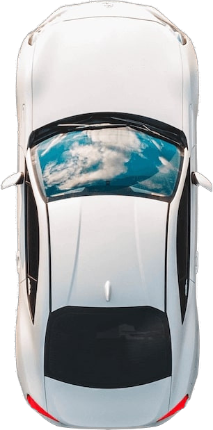

## Zmodeler3 | Vehicles Light IDs
!!! Keep in mind that basic _Zmodeler3_ knowledge is required. You can learn about it **[here](http://wafelowski.pl/grav/en/zmodeler3/basics)**.

#### How do I edit the Light IDs?
> First you must select the part you want to use. 
>  Then switch to Vertices mode, and select the vertices that should light up. You can also select in polys mode first, then switch to vertices mode.
>  Go to Properties tab, General > External State category, and set the ID value to desired number.

[ui-callout]
[ui-callout-item title="Left Headlight" position="13%, 18%, se"]
**Name:** headlight_l
 **ID:** 1
[/ui-callout-item]
[ui-callout-item title="Right Headlight" position="13%, 82%, sw"]
**Name:** headlight_r
 **ID:** 2
[/ui-callout-item]

[/ui-callout]

[ui-accordion independent=true open=none]
[ui-accordion-item title="Click to expand ID List"]
##### Left Headlight
> ID: 1
>  Name: headlight_l

##### Right Headlight
> ID: 2
>  Name: headlight_r

##### Left Taillight
> ID: 3
>  Name: taillight_l

##### Right Taillight
> ID: 4
>  Name: tailight_r

##### Front, Left Indicator
> ID: 5
>  Name: indicator_lf

###### Front, Right Indicator
> ID: 6
>  Name: indicator_rf

###### Rear, Left Indicator
> ID: 7
>  Name: indicator_lr

###### Rear, Right Indicator
> ID: 8
>  Name: indicator_rr

###### Left Brakelight
> ID: 9
>  Name: brakelight_l

###### Right Brakelight
> ID: 10
>  Name: brakelight_r

###### Middle Brakelight
> ID: 11
>  Name: brakelight_m

###### Left Reverse Light
> ID: 12
>  Name: reversinglight_l

###### Right Reverse Light
> ID: 13
>  Name: reversinglight_r

###### Extra Light 1
> ID: 14
>  Name: extralight_1

###### Extra Light 2
> ID: 15
>  Name: extralight_2
[/ui-accordion-item]
[/ui-accordion]

***

List made originally by BILLWARD on [LSPDFR.com](https://www.lcpdfr.com/forums/topic/60868-zmodeler3gtav-vehicle-light-ids/) Forums. 
Car Image from [Interfleet.pl](https://interfleet.pl/storage/photos/4/Unsplash_car_5.jpg).